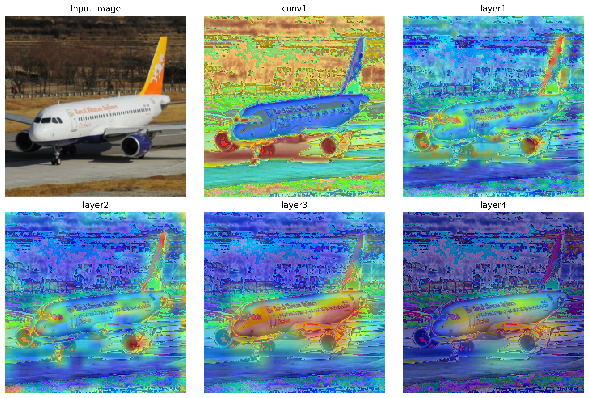
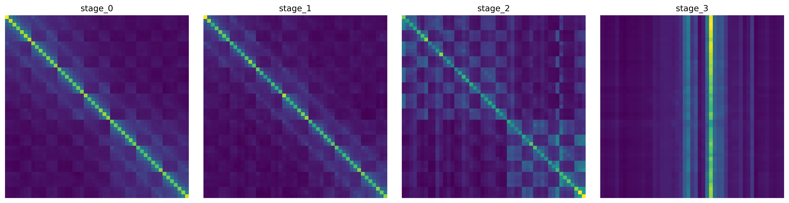
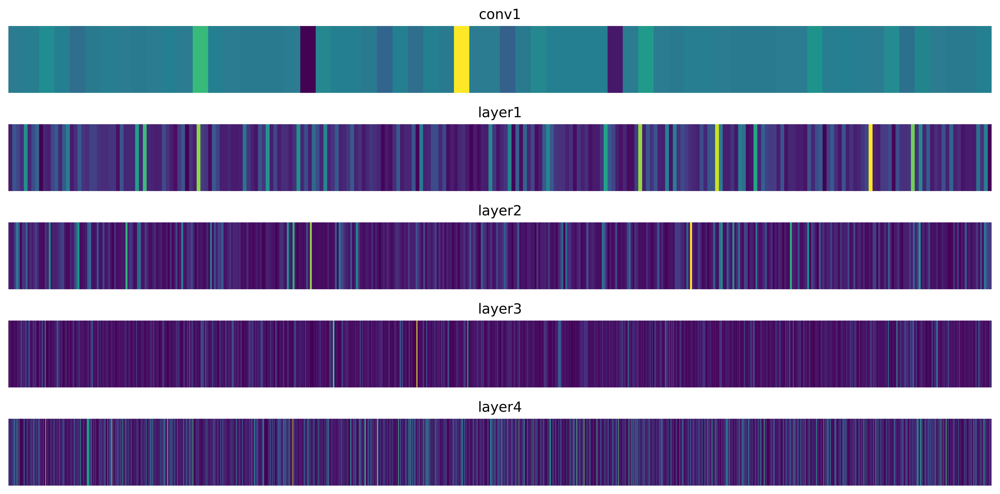
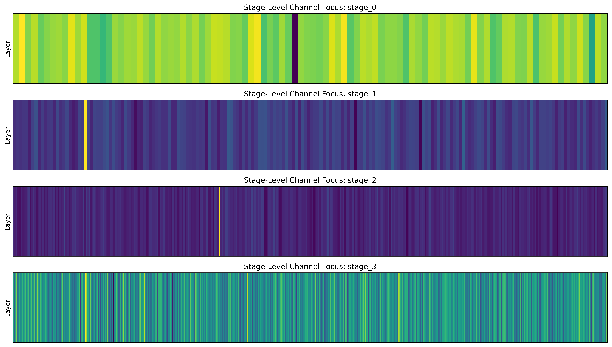

# Visual Interpretation of Learned Representations in ResNet and Swin Transformer Architectures

## Overview

Understanding how deep vision models process and represent information internally is central to interpretability and model design. This repository presents a visualization pipeline to examine and compare internal representations in Convolutional Neural Networks (CNNs) and Vision Transformers (ViTs), using ResNet-50 and Swin-Tiny as representative models.

The pipeline extracts spatial and channel activations from ResNet, and attention maps and token embedding dimension activations from Swin, enabling layer-wise visualization. It is non-invasive, the model architecture is not altered and no retraining is required. Custom pretrained or fine-tuned weights trained with the default architectures load directly into the instrumented models. No backward pass is involved.

Both models are trained and evaluated on FGVC-Aircraft, where Swin-Tiny outperforms ResNet-50 in classification performance and demonstrates more selective and structured internal representations.

### Model selection

ResNet-50 and Swin-Tiny were chosen as representative CNN and ViT variants. Both offer a practical balance of depth and computational efficiency, both expose clearly segmented stages suitable for comparison, and they have reletively comparable parameter counts.

| | ResNet-50 | Swin-Tiny |
| --- | --- | --- |
| Stages | `conv1`, `layer1`–`layer4` | `stage_0`–`stage_3` (patch merging, localized self-attention) |
| Extracted | Spatial activation maps, channel activation maps | Multi-head self-attention weights, post-MLP token embeddings |
| Parameters | 23,651,462 (≈23.6 M) | 27,573,184 (≈27.6 M) |

Note: Throughout this repository, as in the paper, any reference to "channel activations" for the Swin Transformer means activations over the **token embedding dimensions** (the analogue of CNN channels).


## Repository structure

```
├── instrumented_models/
│   ├── resnet_instrumented.py          # ResNet50_InternalRepresentation
│   └── swin_instrumented.py            # SwinTiny_InternalRepresentation
├── visualization_utils/
│   ├── resnet_visualization_utils.py   # spatial / channel progression, heatmap overlay
│   └── swin_visualization_utils.py     # attention progression, attention matrices, channel progression
├── prepare_dataset.ipynb               # bounding-box cropping, 70 family classes, 80-10-10 split
├── train_resnet-50_swin-tiny_fgvc-aircraft.ipynb   # fine-tuning and test evaluation for both models
├── resnet visualized.ipynb             # ResNet-50 figures
├── swin visualized.ipynb               # Swin-Tiny figures
├── resnet sparsities.ipynb             # ResNet-50 activation sparsity
├── swin sparsities.ipynb               # Swin-Tiny token and feature sparsity
├── saved_heatmaps/                     # figures reproduced in the paper
└── a5-jsw-1_crop.jpg                   # cropped FGVC-Aircraft image used for the qualitative figures
```


## Extraction of internal representations

For each model, forward hooks capture intermediate representations at key processing stages during a forward pass, applying non-invasive modifications while preserving pretrained behavior.

### ResNet-50 `ResNet50_InternalRepresentation`

Forward hooks are registered on the early convolutional layer (`conv1`) and each of the four residual stages (`layer1` through `layer4`) to capture output feature maps during inference. Two forms of focus map are derived from each `[B, C, H, W]` tensor:

- **Spatial activation maps**: mean activation across all channels, giving a 2-D map per sample that reflects the spatial focus of that layer.
- **Channel activation maps**: mean activation across the spatial dimensions, giving a 1-D vector that highlights the relative importance of each channel.

### Swin-Tiny `SwinTiny_InternalRepresentation`

Forward hooks are registered on every `WindowAttention` module in all transformer blocks across the four stages to capture self-attention patterns. Because the original `WindowAttention` modules do not expose raw attention weights, a lightweight monkey-patching strategy overrides their `forward` methods at runtime, intercepting and storing the raw multi-head self-attention tensors as part of the forward pass. The original method is preserved as `original_forward`.

Hooks on the MLP submodule of each block capture token embeddings after the self-attention and normalization steps, from which two feature summaries are computed:

- **Token representations**: output token embeddings stored per block, preserving fine-grained spatial information across all tokens in a window.
- **Channel focus vectors**: mean activation across all tokens, giving a 1-D vector per sample reflecting average channel-wise activation strength for that block.


## Visualization techniques

Run `resnet visualized.ipynb` and `swin visualized.ipynb` to generate the figures; each saves a 600-dpi PNG.

### ResNet-50

- **Spatial activation progression**: activation tensors averaged over the channel dimension and rendered as normalized colour heatmaps, allowing layer-wise comparison of how spatial focus is refined or dispersed with depth. A second variant upsamples these maps and blends them with the original input image to highlight regions of high neural response.
- **Channel activation progression**: 1-D channel descriptors visualized as horizontal heatmaps, where intensity indicates the magnitude of channel activation, showing how discriminative capacity is distributed across feature channels.

### Swin-Tiny

- **Spatial attention progression**: attention weights averaged across heads and queries to give a per-token summary, rearranged into a 2-D spatial layout to produce interpretable heatmaps for every block. A second variant projects each attention distribution into the 2-D spatial domain, upsamples it to the input resolution, and blends it with the input image.
- **Attention matrix progression**: attention aggregated at the stage level by averaging over heads, tokens, and blocks, producing one 2-D map per stage that captures the dominant attention pattern characteristic of that stage.
- **Channel activation progression**: mean activations over token embedding dimensions from the MLP outputs of all blocks within each stage, displayed as horizontal heatmaps.


### Discussion

#### Spatial activation and attention
ResNet's spatial activation visualizations (Fig. 1 and Fig. 2) reveal how convolutional layers extract hierarchical features, beginning with fine-grained textures and edges in early layers and evolving into more abstract, object-centric representations with reduced spatial resolution in deeper layers. Swin's spatial attention maps (Fig. 4 and Fig. 5) highlight the most relevant spatial patches across different stages, showing its self-attention mechanism adaptively weighing the importance of various image regions. Both approaches shift from global context to localized object understanding as depth increases, but the attention maps offer a more direct and interpretable view into where the model is focusing, rather than just what features are being activated.

<br> <p align="center">
    
    <br> <sub> <b>Fig. 2.</b> ResNet-50's spatial activation progression visualized with input image overlay. </sub>
</p> <br>

<br> <p align="center">
    
    <br> <sub> <b>Fig. 5.</b> Swin-Tiny's spatial attention progression visualized with input image overlay. </sub>
</p> <br>

The attention matrix heatmaps (Fig. 3) show the evolution of attention across stages. In early stages (`stage_0` and `stage_1`), a strong diagonal indicates that the model primarily attends to nearby tokens within local windows. As the network deepens (`stage_2` and `stage_3`), the patterns become more diverse and less localized, with strong vertical lines signifying an increasing ability to capture global dependencies and attend to distant but relevant image regions.

<br> <p align="center">
    
    <br> <sub> <b>Fig. 3.</b> Progression of attention matrix across major stages in Swin-Tiny. </sub>
</p> <br>

#### Channel activation
Both models show evolving channel activations reflecting their distinct architectural approaches to feature extraction. ResNet-50's channel activations (Fig. 6) demonstrate a progressive refinement of local, hierarchical features. Swin-Tiny's stage-level channel activations (Fig. 7), derived from its token processing and MLP layers, show feature representation evolving from localized patterns in early stages to more integrated, global characteristics through its shifted window attention and hierarchical structure.

<br> <p align="center">
    
    <br> <sub> <b>Fig. 6.</b> Channel activation progression in ResNet-50. </sub>
</p> <br>

<br> <p align="center">
    
    <br> <sub> <b>Fig. 7.</b> Channel activation progression in Swin-Tiny. </sub>
</p> <br>
